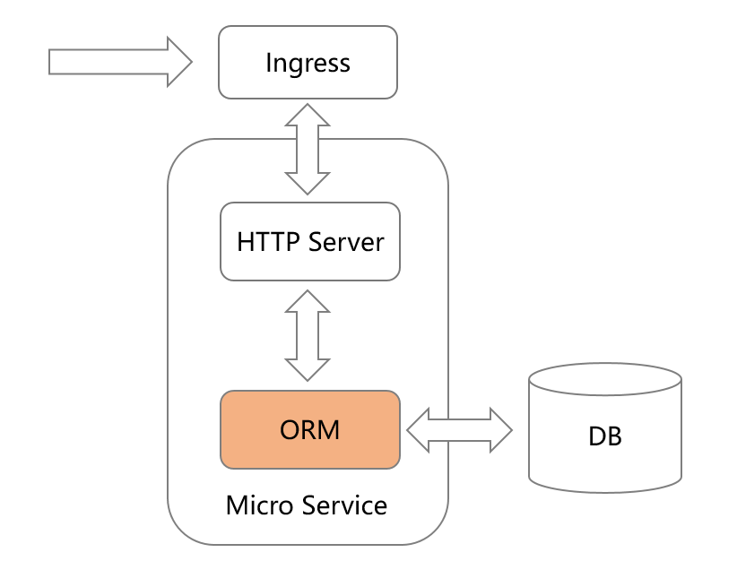

# OpenSourceForHuaweiDemoGo

本项目作为 Go 版本的微服务开发示例，使用 [go-zero](https://go-zero.dev/) 作为微服务框架，数据库使用华为云 GaussDB，项目结构按照 go-zero 最佳实践来布局。

git clone https://gitcode.com/HuaweiCloudDeveloper/OpenSourceForHuaweiDemoGo.git

cd OpenSourceForHuaweiDemoGo

1.下载 GaussDB 驱动包：

https://support.huaweicloud.com/centralized-devg-v8-gaussdb/gaussdb-42-1836.html

2.修改 go.mod 文件，添加：

replace gitee.com/opengauss/openGauss-connector-go-pq => ./openGauss-connector-go-pq

3.初始化数据库：

在华为云 GaussDB 数据库终端执行 user/user.sql 语句，创建数据表。

4.数据库需要配置DSN：

(1)在项目配置文件中 user/etc/user-api.yaml 配置； 

(2)或者使用环境变量 DSN 配置；

5.运行示例： 

cd user 

go run user.go

# 在华为云部署示例项目

使用华为云 CodeArts 通过编译构建任务，将软件的源代码编译成镜像，并把镜像推送归档到容器镜像服务（SWR）中。

参考Wiki：https://gitcode.com/HuaweiCloudDeveloper/OpenSourceForHuaweiWiki/blob/main/zh_CN/docs/go/cicd-pipeline.md

